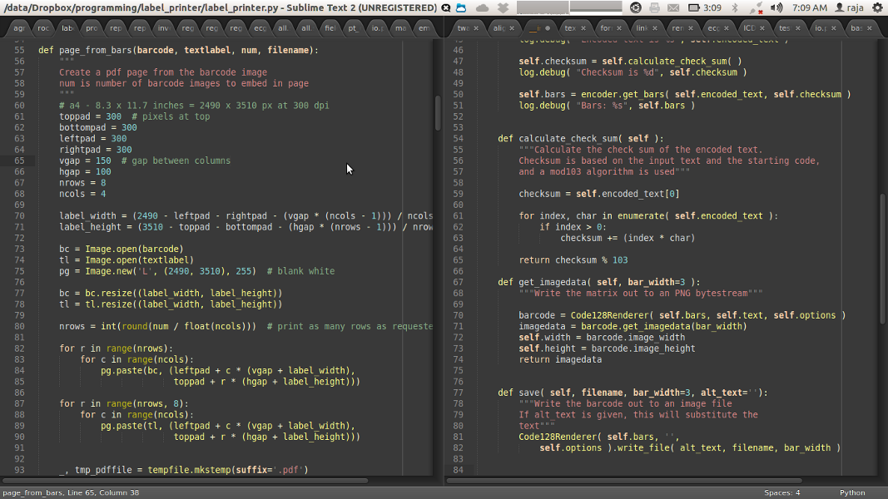

.. title: A month with Sublime Text
.. slug: a-month-with-sublime-text
.. date: 07/31/2012 05:45:04 PM UTC+05:30
.. tags: code
.. link: 
.. description: 
.. type: text

I don't write code for a living, still the amount of time I spend doing it makes me value a good editor. Like any decent programmer I am picky about what I use and biased towards what I prefer. Over the years, I have tried out a few different editors, notably gedit, geany, SPE, Komodo edit, Vim and Emacs. With patience and persistence, I think anyone will ultimately find the answer in Vi(m) or Emacs. For me it was Emacs that clicked and since the last 4 years or so, I have not really felt the need to try out another editor. With all the noise about Sublime Text, I thought it was time to give it a whirl, especially with the release of version 2, especially since some of the things in my current emacs setup were broken after the upgrade to Emacs 24. I used Sublime Text for about a month and these are some of my impressions -

.. TEASER_END

   
1. ST is blazing fast. With about 10 open files, it still restarts virtually instantaneously, while Emacs, even with my core i7 processor and SSD, takes a few seconds to start up. Practically though, this is not of much importance, since with my usual workflow, Emacs is always open and I wait for it to start up only once in a month or so when I reboot after a kernel upgrade.

2. It comes with batteries included! With the default install, it is nice to see most things work automatically. In python mode for example, indentation, autocompletion, code folding all work out of the box. Once the package manager is installed, it is very easy to find and install additional packages. Although Emacs diehards usually discount the usefulness of folding, I found it quite useful and it is absolutely effortless in ST.

3. The enthusiasm of the author and the community for new developments in ST is infectious and even if the intermittent popups reminding you that is a trial are a little irritating, it is an incredibly good decision to allow a free trial without time limit to attract new users. 

4. Coming from Emacs, the thing that I had the biggest difficulty in adjusting to was with creating a new file. The process in Emacs is a good example of the smooth workflow that has evolved with time. Creating a new file is the same as opening a file. If the parent directory does not exist, Emacs still creates the file and opens the buffer with a warning that you have to create the parent directory. And on M-x make-directory, the path for the parent directory is automatically filled in, so all you have to do is press enter. Compared to this ST's traditional method of 'Create file' followed by 'Save' seems cumbersome.

5. I could not get syntax highlighting to work with Markdown mode in ST. Other people have reported this and suggest that this is a problem with certain themes, but there was no change for me with different themes. 

6. While Emacs can use a file dialog, the default method to display files for opening or saving is in the minibuffer. Again, having got used to this, dialogs seem so much out of place, but I could not find any plugin to get ido like behaviour for opening files in ST.

7. Macros are a very powerful feature of Emacs and ST has them too. Or is supposed to have them too. While I did not have problems with a few simple macros, most of those I tried did not work as expected. I did not spend much time trying to debug, but it is likely that the keybindings introduced by Sublemacspro may have been responsible. But again, with Emacs, macros have never gone wrong, no matter what keybindings have been changed.

8. Self documentation is another powerful feature of Emacs. For example, 'C-h k' for 'describe key' will bring up the function currently bound to that key. I sorely missed something like that in ST. Key bindings in ST are defined in multiple places, so again it was not easy to find the current binding for a key combination. This also makes it more difficult customizing ST compared to Emacs where you can put all your customizations in one file or a few files as you wish.

9. The killer feature that forced me to return to Emacs is org-mode. I am not a power user of org-mode, far from it. But still I use it to store a few notes and I found my self opening Emacs just to use my org files. There seems to be some preliminary effort to make an org-mode clone in ST, but there is nothing functional yet.

All in all, it was a good experience and it was with somewhat mixed feelings that I returned to Emacs. I have subsequently tweaked my Emacs to get some of the features I missed after leaving ST. My general impression is that ST seems to principally cater for those coming from Textmate. For Vim users, it might again be a reasonable switch as it seems to have good support of Vi keybindings. Emacs bindings are provided by a package and are still not perfect. For now, I am comfortably back in Emacs, but might try ST again after some time. A month has been too short a time to evaluate an editor and I have not tried any serious customization. 
