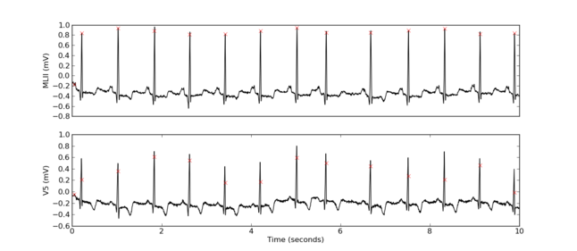

.. title: Using wfdbtools
.. slug: using-wfdbtools
.. date: 06/15/2013 06:01:51 PM UTC+05:30
.. tags: code
.. link: 
.. description: 
.. type: text

wfdbtools_  is a pure python module for accessing and using the waveform data in Physiobank_. Provides rdsamp and rdann which are the python equivalents of the wfdb applications of similar names. A deliberate attempt is made to try to keep names and usage similar to the original wfdb applications for simplicity of use.

.. TEASER_END

The only dependency that will need to be installed is numpy. However, to use the function plot_data, which is an utility function for interactive use, you need to have matplotlib also installed.

Example Usage:

.. code:: python

   from wfdbtools import rdsamp, rdann, plot_data
   from pprint import pprint

   # Record is a format 212 record from physiobank.
   # Note that name of record does not include extension.
   record  = 'samples/format212/100'

   # Read in the data from 0 to 10 seconds
   data, info = rdsamp(record, 0, 10)

   # returned data is an array. The columns are time(samples),
   # time(seconds), signal1, signal2
   print data.shape
   (3600, 4)

   # info is a dictionary containing header information
   pprint info
   {'first_values': [995, 1011],
   'gains': [200, 200],
   'samp_count': 650000,
   'samp_freq': 360,
   'signal_names': ['MLII', 'V5'],
   'zero_values': [1024, 1024]}

   # And now read the annotation
   ann = rdann(record, 'atr', 0, 10)

   # ann has 3 columns - sample number, time (sec) and annotation code
   print(ann[:4,:])
   array([[  18.   ,    0.05 ,   28.   ],
          [  77.   ,    0.214,    1.   ],
          [ 370.   ,    1.028,    1.   ],
          [ 662.   ,    1.839,    1.   ]])

   # Plot the data and the mark the annotations
   plot_data(data, info, ann)

.. _wfdbtools: https://github.com/RajaS/ecgtk/blob/master/ecgtk/wfdbtools.py
.. _Physiobank: http://www.physionet.org/physiobank/
